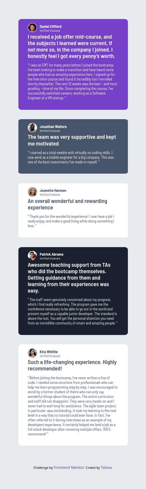
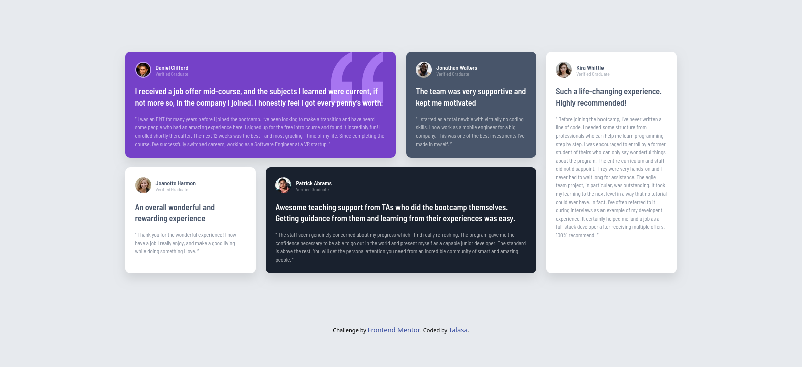

# Frontend Mentor - Testimonials Grid Section Solution

This is my solution to the **Testimonials Grid Section** challenge on Frontend Mentor. This challenge helped me improve my understanding of CSS Grid, responsive design, and layout debugging.

---

## 📸 Screenshot

---

## 🔗 Links

* Solution URL: https://www.frontendmentor.io/solutions/your-solution-link
* Live Site URL: [https://your-live-site-url.com](https://talasadev.github.io/FrontendMentor-Testimonial-Section-Grid/)

---

## 🛠️ Built with

* Semantic HTML5
* CSS custom properties (variables)
* CSS Grid
* Flexbox
* Mobile-first workflow

---

## 📱 Responsive Design

The project is fully responsive and includes:

* Mobile layout (single column)
* Tablet layout (2-column grid)
* Desktop layout (4-column grid with spanning elements)

---

## 🎯 What I learned

While working on this project, I improved my skills in:

* Using `grid-template-areas` for complex layouts
* Debugging layout issues caused by `max-width` and fixed sizing
* Creating responsive layouts with multiple breakpoints
* Improving visual hierarchy with typography and spacing

---

## ⚠️ Challenges I faced

One of the main challenges was understanding why grid items were not spanning correctly.

This was caused by:

* A `max-width` restriction on grid items
* Fixed column sizes preventing proper expansion

I learned how CSS Grid interacts with element sizing and how to let the layout system control spacing.

---

## 🚀 Continued development

I would like to continue improving:

* Writing more reusable and scalable CSS
* Creating consistent spacing systems
* Building more complex responsive layouts

---

## 👤 Author

* Frontend Mentor - https://www.frontendmentor.io/profile/TalasaDev

---

## 🙏 Acknowledgments

Thanks to the Frontend Mentor community and resources for helping me understand CSS Grid better.
